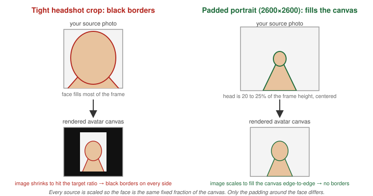

[← Back to Phase 2 — Build](../build.md)

# Create an Avatar and an Agent

## Create an Avatar

```
POST https://api.avatar.us.kaltura.ai/v1/avatar/create
```

```json
{
  "voice": { "id": "KbakCphLGyrStJ2sp8mp", "speed": 1.0 },
  "visual": {
    "id": "f5a6b7c8-d9e0-4f1a-2b3c-4d5e6f7a8b9c",
    "motionControl": { "speaking": 0.7, "nonSpeaking": 0.2 }
  },
  "openingPhrase": "Hello! I'm StreamBot. How can I help you today?"
}
```

`voice.id` and `visual.id` come from the catalog (see [Phase 1 — Design](../design.md) § Browse the Catalog). Returns `id` (24-char hex). **No `adminTags`** — avatars reject unknown fields. Tag the parent agent instead.

If `visual.id` points at a custom uploaded portrait rather than a catalog preset, how you crop that source photo directly affects how the persona renders on this avatar — pad it generously rather than a tight headshot crop:



See [Phase 1 — Design § Upload a Custom Visual](../design.md#upload-a-custom-visual-portrait--animated-avatar) for the full crop-fit explanation.

**Faster path — pick a curated preset instead of assembling voice+visual by hand:** `mgmt.avatars.listTemplates(ks, opts)` lists ready-made `{voice, face}` bundles (dozens of curated presets — "Adam", "Amir", "Ben", ...). Useful for a fleet product that spins up many agents fast (one avatar per sales rep, a demo generator) and wants a "pick a good-looking preset" step instead of a build-your-own-face-plus-voice wizard every time.

```js
const templates = await mgmt.avatars.listTemplates(ks, { pageSize: 10 });
const t = templates[0]; // { id, name: 'Adam', voice: { id }, face: { id, imageUrl } }
await mgmt.avatars.create({ voice: t.voice, visual: { id: t.face.id }, openingPhrase: 'Hi!' }, ks);
```

---

## Create an Agent

```
POST https://api.avatar.us.kaltura.ai/v1/agent/create
```

```json
{
  "displayName": "StreamBot Support Agent",
  "intellect": {
    "intellectType": "genie",
    "id": 1389
  },
  "avatarIds": ["6a07d63d8ccd85cbfafc5416"],
  "adminTags": ["support"],
  "maxConversationLength": 900
}
```

| Field | Notes |
|-------|-------|
| `intellect.intellectType` | Always `"genie"` |
| `intellect.id` | The intellect's configId, from intellect create — passed straight in, no discovery step |
| `avatarIds` | Optional — omit for a headless text-only agent |
| `maxConversationLength` | Seconds. Default 540, range 1–3600 |
| `widgetConfig.initialPage.title` | Max 30 chars |

Returns `agentId` (UUID). **Save this.**

---

## Brain-Model & Rate-Limit Fields (not in the public API)

`agent_llm`, `agent_fast_llm`, `agent_avatar_llm`, `run_quota_check`, `web_search_config`, and the four rate-limit fields (`rate_limit_per_minute`, `rate_limit_per_hour`, `anonymous_rate_limit_per_minute`, `anonymous_rate_limit_per_hour`) exist on the backend intellect record, but no public route reads or writes them — `intellect/get`/`intellect/update` never expose or accept them, and there is no separate endpoint that does. They're set by internal tooling only.

**SDK:** `mgmt.intellectConfig.describe(configId, ks)` lists every one of these under its `readOnly` map, each with a short note, so a UI can render them as informational without hardcoding the list:

```js
const { readOnly } = await mgmt.intellectConfig.describe(configId, ks);
readOnly.agent_llm; // { value: <whatever intellect/get returns for this key, if anything>, note: 'set by internal tooling only, not writable via the public API' }
```

---

## Related docs

| Doc | What it adds |
|---|---|
| [`intellect.md`](intellect.md) | The intellect an agent's `intellect.id` points at |
| [`../build.md`](../build.md) | The Phase 2 — Build index |
